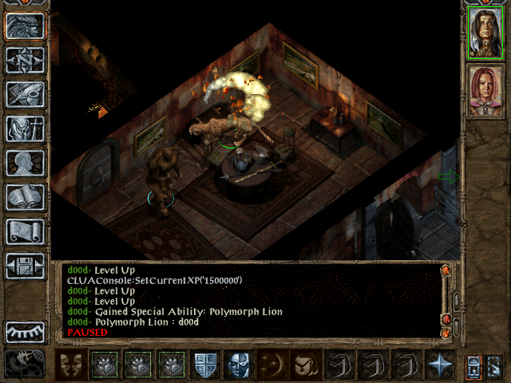
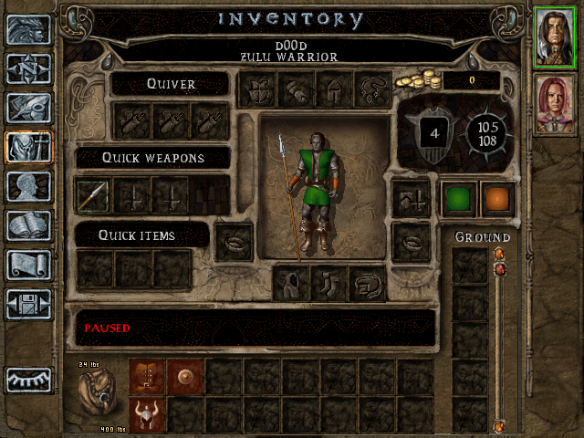
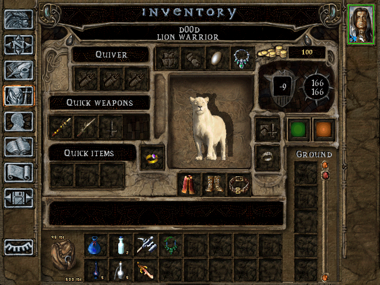

<a name="top" id="top">

<h1></a>Lion Warrior ranger kit (WIP)</h1>

<h3>A mod hosted by Spellhold Studios for Baldur's Gate II: Throne of Bhaal, EE games (except Planescape),
Baldur's Gate Trilogy and EET<h3>

 

**Original Author:** vilkacis  
**Mod Website and Forum:** <a href="http://www.shsforums.net/topic/31691-the-lion-warrior-kit-formerly-zulu-still-a-ranger/">Spellhold Studios</a>  

<a href="#intro">Overview</a> &#x2B25; <a href="#compat">Compatibility</a> &#x2B25; <a href="#installation">Installation</a> &#x2B25; <a href="#components">Components</a> &#x2B25; <a href="#credits">Credits</a> &#x2B25; <a href="#versions">Versions History</a>
 

## Overview

This mod adds a new ranger kit, inspired by <a href="http://www.shsforums.net/topic/31654-thandi-the-zulu-warrior/">Scipio's topic</a> in Mod Ideas. See it as self-improvement, modding practice, or something.

Scipio wanted an un-armoured melee fighter/druid hybrid with a werelion shape-change. I took a ranger and added two extra spells per level and a lion shape, which is gained at level 13 (there is no werelion, so I used the regular one - which is actually not very lion-like, more leopard). The kit offers much better fighting skills than the average ranger, but can't use missile weapons and shares the Kensai's equipment restrictions (ouch!).

I have no idea if this is anywhere near balanced. I'm very very open to all sorts of comments and suggestions.

## Compatibility

This mod is designed to work on the following Infinity Engine games: the original Baldur's Gate II (BG2 or just SoA) with the Throne of Bhaal (ToB) expansion, Baldur's Gate II: Enhanced Edition (BG2EE), the conversion projects Baldur's Gate Trilogy (BGT) and Enhanced Edition Trilogy (EET).

This is a WeiDU mod, and therefore should be compatible with all WeiDU mods. If you encounter any bugs, please report them on the forum! 

Kit revisions

<a href="#top">Back to top</a>

## Installation

#### Notes

<em>If you've previously installed the mod, remove it before extracting the new version. To do this, run **setup-jl#zulu.exe**, uninstall the previously installed main component and delete the jl#zulu folder.</em>

<em>When installing or uninstalling, **do not close the DOS window** by clicking on the **X** button! Instead, press the **Enter** key whenever instructed to do so.</em>

**Disable any antivirus** or other memory-resident software before installing this or any other mod. Some (particularly avast and Norton!) have a tendency to report false positives with mod activity, resulting in failed installs.

## 

#### Enhanced Editions Note

The Enhanced Editions are actively supported games. Please note that every patch update will wipe your current mod setup! If in the middle of a modded game you might want to delay the patch update (if possible) as even after reinstalling the mods, you might not be able to continue with your old savegames. Alternatively, copy the whole game's folder into a new one that can be modded and will stay untouched by game patches. It is important that you install the mod to the language version you are playing the game in. Otherwise, the dialogues of the mod will not show but give error messages.

## 

#### Windows

Extract the contents of the mod archive into the folder of the game you wish to modify (<em>the folder which contains the "CHITIN.KEY" file</em>), using <a href="http://www.7-zip.org/download.html">7zip</a>, <a href="http://www.rarlab.com/download.htm">WinRAR</a>, or another file compression utility that handles .zip files. On successful extraction, there should be a jl#zulu folder and a setup-jl#zulu.exe file in your game folder. To install, simply double-click **setup-jl#zulu.exe** and follow the instructions on screen.

Run **setup-jl#zulu.exe** in your game folder to reinstall, uninstall or otherwise change the component settings.

## 

#### Note for Complete Uninstallation

In addition to the methods above for removing individual components, you can completely uninstall the mod using **`setup-jl#zulu --uninstall`** at the command line to remove all components without wading through prompts. 

<a href="#top">Back to top</a>

## Components

The installer includes one single component, the main component.

Description

 
LION WARRIOR: This ranger follows traditions handed down by the Lion Tribes of Shaar, combining deadly fighting ability with unmatched wilderness survival skills and a particularly strong connection with Nature. He disdains missile weapons, but few can match his strength in melee.

Advantages:
- +2 bonus to Armor Class at 1st level, plus an additional +2 bonus at 15th level.
- +1 bonus to hit and damage rolls every 10 levels (starting at 1st level).
- 13th level: May shapeshift into the form of a lion once per day. Gains one additional use every 5 levels thereafter.
- May memorize two extra spells of each level.
- May attain the highest level of mastery in any melee weapon.

Disadvantages:
- May not use missile weapons
- May not wear armor
- May not wear gauntlets or bracers
- Does not gain the ranger's Charm Animal ability

<a href="#top">Back to top</a>

## Screenshots

Meow! The lion is pretty strong. Its stats are very random, so it will probably need to be revised. 

Can't use armour! (Don't even mention the name of the... well, d00d.) This also shows off the nifty AC bonus.

Showing off the lion paperdoll...

<a href="#top">Back to top</a>

## Credits and Acknowledgements

#### Author: <a href="http://www.shsforums.net/user/6209-vilkacis/">vilkacis</a>

#### Special Acknowledgements to:

- Original idea: <a href="http://www.shsforums.net/user/8913-scipio/">Scipio</a>
- Gwendolyne: Fixed translations and released version 2.0.0.
- Deratiseur: Provided French translation, the EE compatible version and released version 1.5.
- Special thanks to GeN1e, Jarno Mikkola, Icendoan, smoky tune, the bigg, and Zauberbratsche at the SHS forums for their help and/or advice..

If you wish to translate the mod, have a suggestion, or should encounter any bugs, please report them to the maintainers at the <a href="http://www.shsforums.net/topic/31691-the-lion-warrior-kit-formerly-zulu-still-a-ranger/">mod forum</a>. 

#### Copyrights Information

###### Lion Warrior Kit is not developed, supported, or endorsed by BioWare&trade; or Interplay/BlackIsle, Overhaul, Beamdog or the Wizards of the Coast. It was developed by vilkacis, based on material from the game Baldur's Gate II and its expansion.
###### Baldur's Gate II: Shadows of Amn and Baldur's Gate II: Throne of Bhaal &copy; TSR, Inc. The BioWare Infinity Engine is &copy; BioWare Corp. All other trademarks and copyrights are property of their respective owners.
###### All other trademarks and copyrights are the property of their respective owners. 

<a href="#top">Back to top</a>

## Versions History

##### Version 2.0.0 (, 2019)

- Renamed Setup-zulu.tp2 -> jl#zulu.tp2 to support AL|EN's "Project Infinity".
- Added jl#zulu.ini metadata file to support AL|EN's "Project Infinity".
- Lion pawn (jl#zpaw.itm): Added magical flag (BIT6), plus EE: Forbid off-hand weapon (BIT13) and EE/Ex: Undispellable (BIT24) according to the game.
- Shapeshift: Lion ability (jl#zpoly.spl): Added ability description strref to fit EE games. Added Ignore dead/wild magic (BIT14) EE:Ex Castable when silences (BIT25).
- Reorganized mod architecture tree: created folders to sort files according to their types.
- Reorganized component (DESIGNATED number).
- Added REQUIRE_PREDICATE process to avoid installing the mod in inaccurate games.
- Replaced AUTHOR keyword with SUPPORT.
-- Updated French and English translations (Gwendolyne).

## 

##### Version 1.3 (August 3, 2019)

- Traified and adapted mod for EE games (by Deratiseur).
- Updated WeiDU installer to v246.

## 

##### Version 1.2 (November 1st, 2016)

- Updated WeiDU installer.

## 

##### Version 1.1 (December 26, 2008)

- Added French translation (by Deratiseur).

## 

##### Version 1.0 (February, 2008)

- Initial release.

<a href="#top">Back to top</a>

